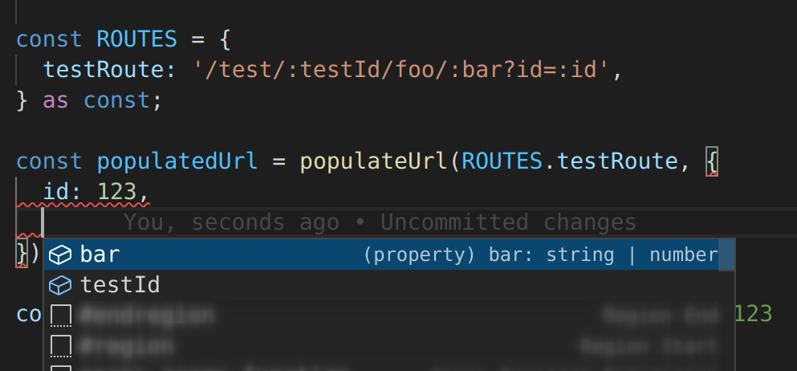

# @bamblehorse/tiny

Helps to populate your URL with path and query parameters.
Has a TS support, that parse constant templates and shows expected parameters.

## Install

```
$ npm install @bbfan/populateUrl
```

## Usage

```js
const ROUTES = {
  testRoute: '/test/:testId/foo/:bar?id=:id',
} as const;

const populatedUrl = populateUrl(ROUTES.testRoute, {
  id: 123,
  bar: 'test',
  testId: null,
});

console.log(populatedUrl); // /test/null/foo/test?id=123
```

## TS Hints Support




